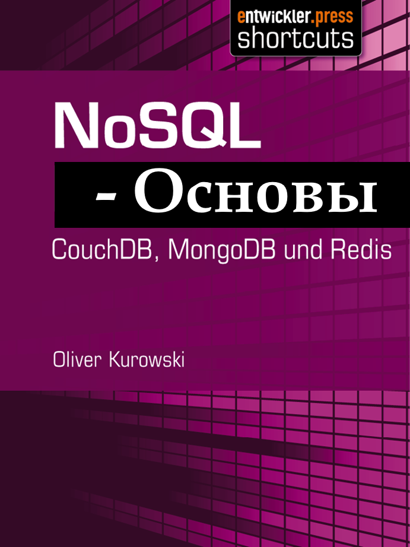

Перевод книги NoSQL - Введение. 2012 год, исходный язык - немецкий

{width=691px height=922px}

**NoSQL: введение**

**Автор:** Oliver Kurowski

**Название:** NoSQL -- Введение

**Формат:** Электронная книга (.epub)

**Оригинальный ISBN:** 978-3-86802-410-4

**Издательство:** [entwickler.press](http://entwickler.press) (подразделение Software & Support Media GmbH)

**Год издания:** 2012

## **Оглавление**

**Глава 1. NoSQL -- дополнение к SQL**

\- История возникновения термина "NoSQL"

\- Причины появления движения NoSQL

\- Преимущества NoSQL перед традиционными базами данных

\- Примеры структур хранения данных в NoSQL системах

**Глава 2. CouchDB: запросы и интеграция с PHP**

\- Что такое CouchDB и её возможности

\- Основные команды для работы с базой данных

\- Особенности реализации запросов и отображений (views)

\- Работа с библиотеками для интеграции CouchDB с PHP

**Глава 3**. **MongoDB: знакомство с возможностями**

\- Структура базы данных MongoDB

\- Типы документов и коллекций

\- Способы хранения и индексации данных

\- Динамические запросы и операции агрегации

\- Использование библиотеки RockMongo для визуализации данных

**Глава 4. Redis: быстрый ключ-значение хранилище**

\- Обзор возможностей Redis

\- Поддерживаемые структуры данных и команды

\- Применение Redis в качестве быстрого кеша и репликационного сервера

\- Интеграция Redis с PHP и другие сценарии использования