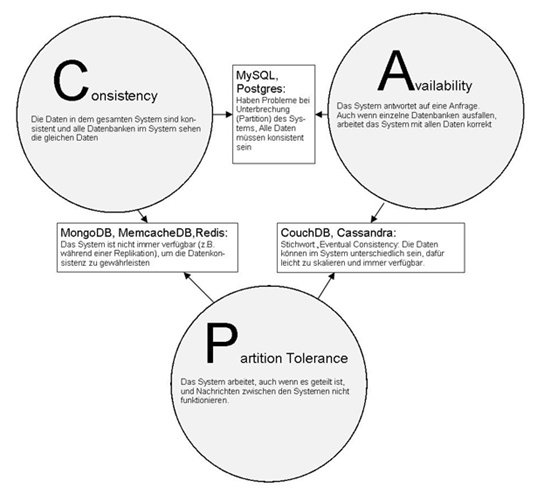
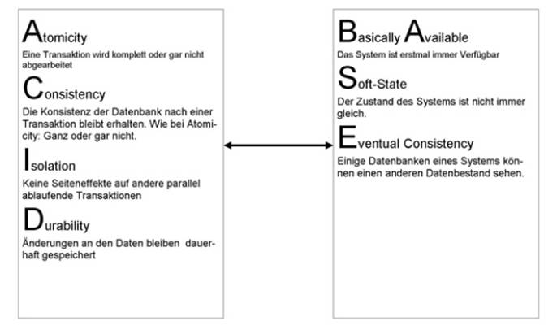

1\. NoSQL -- Дополнение к SQL

В 2009 году разработчик сайта [Last.fm](http://Last.fm) Йохан Оскарссон организовал конференцию, посвящённую технологиям распределённых нереляционных баз данных \[1\]. Тогда никто не подозревал, что термин "NoSQL" вскоре станет названием целого движения, которое достигнет массового уровня среди программистов. Цель мероприятия заключалась в изучении границ традиционных реляционных баз данных применительно к задачам масштабирования, часто возникающим в веб-разработке, особенно для проектов с большим количеством запросов.

Первоначально понятие "NoSQL" подразумевало чёткую границу между SQL и новыми технологиями запросов. Однако сегодня сам Йохан Оскарссон признаёт, что этот термин скорее означает "не только SQL". Эта радикальность формулировки отчасти объясняет нынешний хайп вокруг NoSQL, хотя сами технологии не новы. Вспомним, например, комбинацию XML, JavaScript и асинхронных запросов к серверу, ставшую основой концепции AJAX. Точно так же современные подходы объединяют старые приёмы, такие как хранение данных с произвольными ключами и нестандартные способы запроса данных, превращаясь в узнаваемую технологию лишь благодаря удачному названию.

Итак, давайте дадим определение NoSQL. Если вы уже знакомы с ним, прошу прощения за повторение. NoSQL описывает структуру базы данных без жёсткой привязки к схеме и предусматривает альтернативные механизмы запросов, отличающиеся от стандартных SQL-запросов, используемых в традиционных реляционных СУБД. Наиболее близкими родственниками NoSQL являются объектно-ориентированные и XML-базы данных. Потребность в новых подходах возникла вследствие требований интернета: мощные сервисы онлайн-магазинов, блогов, новостей, форумов, поисковых систем и социальных сетей требуют огромных массивов данных и гибких структур, постоянно меняющихся вместе с требованиями бизнеса. Традиционная корпоративная ПО, ориентированная на безопасность и целостность данных, редко становится целевой аудиторией для внедрения NoSQL-технологий.

\## Свобода от схем

Но в чём именно заключается разница и преимущество схематически свободных баз данных? Давайте рассмотрим традиционный процесс разработки реляционной базы данных. Сначала собираются требования к программе, записываются в техническое задание. Затем проектируются таблицы и отношения, нормализуются и готовятся для реляционной БД. После определения таблиц спецификация передается разработчикам приложений, которые взаимодействуют с системой посредством SQL-запросов и разрабатывают саму программу. Итоговым результатом становится приложение с заранее определёнными структурами данных и функционалом.

Что произойдёт, если изменится одно маленькое, но важное требование? Скажем, система обмена сообщениями должна передавать не только текстовые уведомления, но и файлы, списки или связи с другими сообщениями. Разработчики снова адаптируют схему таблиц, вносят новые структуры и начинают заново. Рассмотрим конкретный пример: торговая платформа обменивается сообщениями между поставщиками и клиентами. Все изменения ассортимента продукции должны передаваться таким способом. Таблица сообщений (\`NACHRICHTEN\`) может выглядеть примерно так:

| Id | Sender_id | Empfaenger_id | Nachrichtentext | Datum | Status |

|----------|-----------|---------------|----------------|------|--------|

| 1 | 1 | 123 | Текст сообщения| Дата | статус |

Однако, если мы хотим включить информацию об изменениях ассортимента товаров, нам потребуется создать дополнительную таблицу (\`NACHRICHTENARTIKEL\`):

| Nachrichten_id | Artikelnummer |

|----------------|---------------|

| 1 | Артикул товара|

Кроме того, возможны ситуации замены одного товара другим. Для обозначения связей между товарами приходится вводить дополнительные столбцы:

| Nachrichten_id | Artikelnummer_1 | Artikelnummer_2 | Beziehungsstatus |

|----------------|-----------------|-----------------|------------------|

| 1 | Старый артикул | Новый артикул | Связь |

Это усложняет структуру данных и увеличивает количество пустых записей. А ведь изменения цен тоже надо учитывать! Добавляется новая таблица (\`PREISAENDERUNG\`):

| Artikelnummer | Alter_Preis | Neuer_Preis |

|---------------|------------|-------------|

| Артикул товара| Старая цена| Новая цена |

Подобные случаи легко придумать самостоятельно. В традиционной реляционной базе данных сначала создаются таблицы и их взаимосвязи, затем схема передаётся разработчику приложения. Но если бы мы использовали NoSQL-базу данных, такую как CouchDB, весь процесс выглядел бы иначе. Нет ни таблиц, ни отношений между ними. Есть только сама база данных, куда записывается документ. Документ состоит из набора полей и значений. Каждый документ имеет уникальную идентификационную запись (\_id) и ревизию (\_rev). Данные передаются в виде пар ключ-значение. В отличие от реляционных баз данных, отсутствует жесткое ограничение на наличие конкретных полей. Вот как мог бы выглядеть документ о повышении цены продукта:

\`\`\`json

\{

"\_id": "1",

"\_rev": "1",

"sender_id": 1,

"empfaenger_id": 123,

"nachrichten_typ": 12,

"nachricht": "Цена товара 12345 увеличилась с 100 руб. до 105 руб.",

"artikelnummer": 12345,

"preis_alt": 100,

"preis_neu": 105,

"datum": "2010-07-19"

}

\`\`\`

Этот документ отправляется в базу данных. Аналогичным образом добавляется сообщение о замене товара:

\`\`\`json

\{

"\_id": "2",

"\_rev": "2",

"sender_id": 1,

"empfaenger_id": 123,

"nachrichten_typ": 3,

"nachricht": "Товар 12340 заменён товаром 22340.",

"artikelnummer_1": 12340,

"artikelnummer_2": 22340,

"preis_alt": 100,

"preis_neu": 105,

"datum": "2010-07-19"

}

\`\`\`

Приложение, извлекающее эти данные, должно обрабатывать разные типы сообщений соответствующим образом. Даже в классической реляционной модели пришлось бы строить разные SQL-запросы для каждого типа сообщения. Возможно было бы объединить возможные типы сообщений в одной таблице, однако отсутствие жесткой схемы даёт больше свободы (см. Листинг 1.3).

Так, очевидно, возникает вопрос: как правильно организовать разнородные данные внутри базы данных? Ответ заключается в введении атрибута `Type`, определяющего тип данных. Сообщения могли бы иметь следующую структуру:

\`\`\`json

\{

"\_id": "1",

"\_rev": "1",

"Type": "Nachricht",

"sender_id": 1,

"empfaenger_id": 123,

...

}

\`\`\`

Типы сообщений будут представлены отдельно:

\`\`\`json

\{

"\_id": "1",

"\_rev": "1",

"Type": "Nachrichtentypdefinition",

"nachrichtentyp_id": 12,

"name": "Повышение цены"

}

\`\`\`

Таким образом, любые сообщения могут быть объединены в единую коллекцию документов, позволяя эффективно управлять различными типами данных без ограничения конкретной структурой.

Здесь уместно отметить, что подобную функциональность можно реализовать даже в обычной реляционной базе данных путём упаковки всех необходимых полей и значений в один строковый тип, например, с использованием формата JSON. Это позволит сохранить всю необходимую информацию в единственном элементе строки. Такой подход возможен, однако он лишает систему преимуществ полноценной NoSQL-модели, где каждая единица данных хранится независимо друг от друга.

Простое выражение `"SELECT * FROM Tabelle WHERE type='Nachricht'"` выдаст нам все сообщения, которые мы можем последовательно перебрать в цикле и показать нужным образом исходя из типа сообщения, извлечённого из преобразованного JSON. Значит ли это, что MySQL тоже можно считать NoSQL? Можно ли доставлять газеты на Боинге 747? Пренебрегая проблемами размещения самолёта на европейских городских улицах, ответ звучит утвердительно: да.

Да, действительно, MySQL вполне может использоваться как схематически свободная база данных. Тем не менее, в таком подходе остаётся только простая роль хранилища данных. Все необходимые запросы придётся реализовывать путем комбинации поиска по текстовому полю "Value" (например, `SELECT * FROM Tabelle WHERE type='Nachricht' AND Value LIKE '%Empfaenger_id: 123%'`) и последующей обработки результатов в приложении. Именно здесь вступают в игру NoSQL-базы данных, предназначенные для непосредственного выполнения запросов прямо в самой базе и предоставления готовых результатов. Поэтому смело утверждаю: MySQL ≠ NoSQL.

Задачи базы данных

Обычно база данных решает две ключевые задачи:

1\. Создание, изменение и удаление данных.

2\. Извлечение, анализ и агрегирование данных.

Эти два направления называются соответственно OLTP (обработка транзакций в режиме реального времени) и OLAP (онлайн-аналитическая обработка). В случае OLTP первостепенное значение имеют целостность данных и способность обрабатывать транзакции, тогда как в OLTP решающую роль играет скорость. Любой пользователь, желающий быстро выводить все сообщения или посты блога на своём сайте, прекрасно поймёт важность скорости, несмотря на допустимую небольшую задержку после нажатия кнопки отправки нового материала. Таким образом, фактор времени при чтении данных оказывается важнее, чем при записи. Идеальным решением для активно посещаемых ресурсов с преобладанием чтений была бы технология, позволяющая легко масштабировать производительность базы данных. Здесь важно учесть, что обращения к нескольким таблицам с использованием объединений (JOIN) сложно распараллеливать между системами и ресурсозатратны даже внутри одного сервера, существенно влияя на временные показатели. Целостность данных, включая правильность самих данных и их взаимосвязей, традиционно обеспечивается принципом ACID:

**ACID**

Этот раздел не предназначен для химиков или любителей музыки... Речь пойдёт о характеристиках систем управления базами данных, обеспечивающих консистентность данных при выполнении транзакций. Буквы аббревиатуры означают следующие свойства («Принцип ACID»):

\- **Atomicity (атомарность)** -- Транзакция рассматривается как неделимая операция. Либо выполняются все шаги транзакции успешно, либо ничего не выполняется вовсе.

\- **Consistency (консистентность)** -- По завершении транзакции состояние данных остается согласованным. Особенно важно соблюдение ссылочной целостности, когда зависимые таблицы остаются взаимно корректными. Нарушение этого принципа ведёт к откату всей транзакции.

\- **Isolation (изоляция)** -- Одна транзакция не должна оказывать побочных эффектов на другие параллельные транзакции. Изменение какого-то элемента не должно сразу отражаться в параллельно выполняемой транзакции.

\- **Durability (устойчивость)** -- Результаты успешной транзакции сохраняются навсегда, даже в случае сбоя системы или перезагрузки сервера.

**Серверные базы данных и концепция ACID**

Односерверные базы данных выполняют концепцию ACID (при условии исправной работы). В отличие от корпоративных решений ERP, обслуживающих ограниченное число пользователей, высоко нагруженные веб-сервисы предъявляют совершенно иные требования. Повышенные нагрузки создают большие различия в производительности между закрытыми корпоративными приложениями и открытыми веб-службами с огромным числом пользователей. Важнейшими методами повышения производительности становятся вертикальное и горизонтальное масштабирование.

\### Вертикальное и горизонтальное масштабирование

**Вертикальное масштабирование** подразумевает повышение вычислительной мощности или объёма памяти отдельной единицы базы данных. Этот подход характерен для внутренних корпоративных систем, где основное внимание уделяется целостности данных, а не одновременному обслуживанию тысяч пользователей (хотя существуют и смешанные формы).

**Горизонтальное масштабирование**, напротив, предполагает добавление отдельных экземпляров баз данных, образующих единый логический кластер снаружи. Горизонтальное масштабирование лежит в основе большинства веб-приложений, работающих совместно с балансировщиками нагрузки или серверами ферм, справляющимися с обработкой большого числа запросов.

При масштабировании на множестве распределённых баз данных возникают проблемы, угрожающие стабильности концепции ACID. Что произойдет, если отдельные узлы сети или соединения между базами данных выйдут из строя? Сегодня стандартом стало объединение множества серверов для хранения данных в социальных сетях и поисковых системах. В случае ошибок появляется риск потери целостности данных по всему сетевому сегменту, приводящий к различным наборам данных в разных частях системы (сетевое разбиение, network partitioning). Итак, каким образом можно надёжно осуществить горизонтальное масштабирование баз данных? Чтобы повысить популярность нашего обзора, представляем два важных понятия.

\### Теорема CAP профессора Брювера

В 2000 году профессор Эрик Брювер выступил с докладом на конференции PODC2000 \[4\], посвящённой основам вычислений в распределенных системах (Principles of Distributed Computing). Там он заявил, что при масштабировании распределённых систем баз данных важны три фундаментальные характеристики (рамка: «Теорема CAP»).

\## Теорема CAP

\### **Консистентность (Consistency):**

Обеспечивает целостность данных относительно транзакций. Любые манипуляции с данными либо выполняются полностью, либо не происходят совсем. Например, если покупатель заказывает последний имеющийся товар в интернет-магазине, а складские запасы не уменьшились на единицу после заказа (предположим, что в нормальных условиях всё работает), данные окажутся несогласованными. Следующий заказ этого товара приведёт к поиску несуществующего товара на складе. В распределённых базах данных, связанных друг с другом, эта характеристика требует, чтобы все системы видели одинаковые наборы данных. Когда заказы распределяются между несколькими базами данных, необходимо гарантировать мгновенную передачу изменений остатков склада во все остальные базы данных. Это свойство критично для интернет-магазинов и сервисов, осуществляющих обмен товарами (например, акциями). Обычно новостные ресурсы и социальные сети менее чувствительны к проблемам синхронизации в реальном времени. Даже если новость мгновенно не появится на всех серверах, система продолжит функционировать нормально.

\### **Доступность (Availability):**

Означает доступность сервиса данных. Система обязана отвечать на запросы. Если после оформления заказа в магазине вы не получаете никакого подтверждения (например, видите пустую страницу браузера), непонятно, выполнена ли ваша покупка. Применительно к группе систем в сети это значит, что остальные системы должны продолжать свою работу, даже если какая-то отдельная система временно перестала давать отклик.

\### **Устойчивость к разделению (Partition tolerance):**

Данные в распределённых базах данных могут различаться из-за внешних факторов. Например, сервер A и сервер B предлагают одни и те же услуги. Предположим, сервер A потерял связь с сервером B из-за аппаратного сбоя (проблемы с кабелем или сетью), при этом оба сервера продолжают быть доступными извне. Теперь данные на обоих серверах могут стать разными. В сети распределённых баз данных крайне важно, чтобы общая система продолжала функционировать, даже если некоторые пакеты данных потеряются при передаче между узлами.

Рисунок 1.1: Теорема CAP

\### **BASE**

Аббревиатура BASE расшифровывается как **Basically Available (Базовая доступность), Soft State (Мягкое состояние) и Eventual Consistency (Отложенная согласованность)**. Эти принципы определяют основную потребность горизонтально масштабируемых систем баз данных, предназначенных преимущественно для обработки информации. Главное требование здесь -- это постоянная доступность системы, состоящей из множества баз данных, при этом согласованность данных занимает второстепенное положение.

Например, в сервисах новостей или социальных сетях, таких как Twitter, не принципиально, чтобы одни и те же сообщения были видны одновременно во всём мире. Задержка в несколько минут при показе моего твита в австралийской глубинке вполне приемлема, пока я могу оперативно публиковать сообщения в систему. Такая ситуация недопустима для финансовых услуг, где важна немедленная согласованность данных.

Интересно, что теорему BASE предложил тот же профессор Брювер, предложивший в 1997 году идею, противоположную принципу ACID. Подобно химии, где кислоты и основания представляют собой противоположные стороны спектра свойств, ACID и BASE теперь символизируют противоположные аспекты подходов к обеспечению характеристик баз данных.

Рисунок 1.2: ACID и BASE

Вернёмся к теореме CAP профессора Брювера: он утверждает, что при масштабировании систем баз данных можно достигнуть только двух из трёх свойств CAP. Эта теория, сформулированная профессором Брювером, была подтверждена опубликованной работой исследователей Сета Гилберта и Нэнси Линч из Массачусетского технологического института (MIT) в 2002 году, получив официальный статус теоремы. Согласно ей, существует три возможных сценария масштабирования, в которые можно классифицировать базы данных (рамка: «Категории сценариев масштабирования»).

\### Категории сценариев масштабирования:

\- **CA (Consistency + Availability)** -- большинство реляционных баз данных попадают сюда. При репликации каждое устройство может читать и писать данные (A), а все базы данных видят одну и ту же картину полных данных.

\- **AP (Availability + Partition Tolerance)** -- сюда входят, например, NoSQL-системы, такие как CouchDB, RIAK и Cassandra.

\- **CP (Consistency + Partition Tolerance)** -- сюда относятся, например, MongoDB, Memcached и Redis.

Следовательно, для масштабирования многочисленных баз данных подходят классы AP и CP. Классическое реляционное представление сложнее масштабируется горизонтально из-за наличия взаимосвязанных таблиц. Более подробную информацию можно найти по ссылке \[5\].

\### Классификация NoSQL-баз данных

Современные NoSQL-базы данных делятся на несколько категорий в зависимости от особенностей логики хранения данных.

\#### Типы NoSQL-баз данных

\### 1. **Документно-ориентированные базы данных**

Данные хранятся не в привычных колонках и таблицах, а в специальных объектах, называемых "документами". Документ представляет собой набор полей и значений. В базе данных нет заранее заданной структуры документов, и каждое из них может отличаться набором полей. Возможности модификации включают изменение существующих полей, добавление новых или удаление старых. Распространённые форматы документов -- JSON и XML. Такие базы данных не поддерживают встроенные отношения между данными; связи между элементами определяются непосредственно в коде программы. Самые известные представители этой категории -- **CouchDB** и **MongoDB**.

\### 2. **Хранилища ключей-значений (Key-value stores)**

По своей сути похожи на ассоциативные массивы, где каждому уникальному ключу сопоставлено простое значение (текст, число, список и т.п.). К этому классу относятся **Riak**, **Redis** и **MemcacheDB**. Они просты в использовании и эффективны для простых типов данных.

\### 3. **Колоночные базы данных (Column-oriented databases)**

Вместо традиционного способа хранения данных построчно, колоночные базы хранят информацию физически по колонкам. При доступе к одному ряду следующий ряд уже не находится рядом с предыдущим, а располагается дальше по той же колонке следующей строки. Это удобно для анализа больших объёмов данных, когда значительная часть полей конкретного ряда игнорируется. Колонные базы отлично подходят для аналитической обработки данных (например, суммирование осадков с 1900 года, где дата и местоположение неважны). Дополнительное преимущество -- возможность сжатия данных в колонках, так как в пределах одной колонки часто встречаются однотипные значения. Один из известных представителей -- **Cassandra**.

\### 4. **Графовые базы данных (Graph databases)**

Основаны на теории графов и состоят из узлов, рёбер и их свойств. Узлы соединены рёбрами, каждое ребро может обладать дополнительными характеристиками. Например, карта маршрутов Deutsche Bahn может представлять собой граф, где узел A -- город Берлин, узел B -- Ганновер, а узел C -- Мюнхен. Между этими узлами располагаются рёбра с параметрами длины маршрута и стоимости проезда. Графовые базы полезны для моделирования сложных взаимоотношений между данными, таких как рекомендации друзей в соцсетях. Яркий представитель -- **Neo4j**.

\## Почему нужно менять мышление?

Многие читатели наверняка задают себе этот вопрос. Конечно, можно ответить коротко: "Потому что это весело!". Но взглянем немного вперёд: смартфоны начнут синхронизироваться с внешними системами, интернет управляет коммуникацией между людьми, и вместе с этим появляются новые требования к обработке данных и программного обеспечения. Пользователи хотят свободно обмениваться информацией: текстом, изображениями, видео, комментариями и сообщениями, создавая разнообразные связи между всеми видами данных. Эти потребности нельзя удовлетворить средствами классических реляционных баз данных. Вместо жёстко заданных структур нужен новый подход, позволяющий быстро и гибко хранить и обрабатывать данные, способный легко масштабироваться. Реляционные базы данных останутся полезными, но дополнятся новым слоем быстрых и адаптивных NoSQL-решений.

Появление новой парадигмы мышления связано не только с изменением способов запрашивания данных, но и с отказом от представлений о табличных структурах и отношениях между ними. Я показал в примере начала главы, что даже традиционные реляционные базы данных позволяют решать все поставленные задачи, но только играя с бессхемными базами данных, вы сможете ощутить элегантность и простоту внесения изменений. Процесс переосмысления непрост, но весьма увлекателен: пройдя начальную фазу подготовки и тренировки, вы начнёте замечать первые успехи, а инсайт-переживания помогут вам постепенно привыкнуть и оценить преимущества NoSQL.

Наша серия статей познакомит вас с представителями мира NoSQL и продемонстрирует, как можно решать различные задачи, которые в SQL-базах могут быть простыми или сложными для реализации. Мы покажем, что NoSQL неоднороден, и подробно остановимся на различиях между отдельными базами данных. Независимо от ваших личных предпочтений -- будь то свобода от жестко заданных схем или лёгкость горизонтального масштабирования, -- вы увидите, что тема NoSQL затрагивает интересные аспекты, важные лично для вас.

\## Полезные ссылки и литература

\- \[Официальный сайт NoSQL-конференции\](<http://nosql.eventbrite.com/>)

\- \[Спецификации формата JSON\](<http://www.json.org/>)

\- \[Страница проф. Эрика Брювера\](<http://www.cs.berkeley.edu/\\\\\\\\\\\\\\\\\\\\\\\\\\\\\\\~brewer>)

\- \[Материалы конференции PODC 2000\](<http://www.podc.org/podc2000>)

\- \[Наглядное руководство по NoSQL-системам\](<http://blog.nahurst.com/visual-guide-to-nosql-systems>)

\- \[Статья о будущем ERP-систем в Computerwoche\](<http://www.computerwoche.de/software/erp/1898039>)